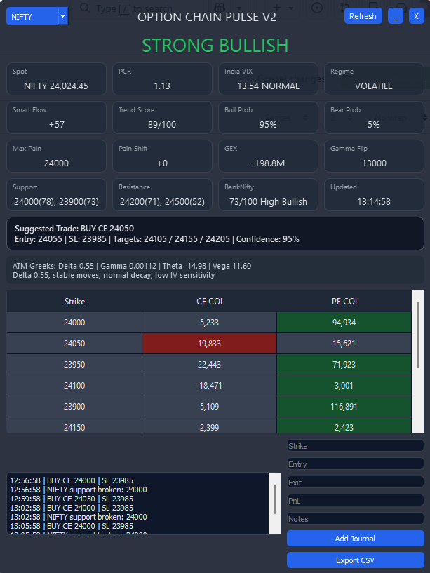

# Option Chain Analyzer

A professional Python-based Option Chain Analyzer for traders and investors.

## Screenshots



## Features

- Open Interest (OI) Analysis
- OI Change Tracking
- Put Call Ratio (PCR)
- Max Pain Calculation
- Gamma Exposure (GEX)
- Support & Resistance Levels
- Live Market Data Integration
- Trading Signals Dashboard

## Technologies Used

- Python
- PyQt5
- Pandas
- NumPy
- Plotly
- NSE Data APIs


## Installation

```bash
git clone https://github.com/ajaylkjhg-maker/option-chain-analyzer.git
cd option-chain-analyzer
pip install -r requirements.txt
python main.py
```

## Future Enhancements

- AI Trade Recommendations
- Telegram Alerts
- Auto Strategy Builder
- Options Flow Analysis

## Author

Amar # option-chain-analyzer
Professional Python-based Option Chain Analyzer with OI Analysis, PCR, Max Pain, GEX, Support &amp; Resistance Levels.
